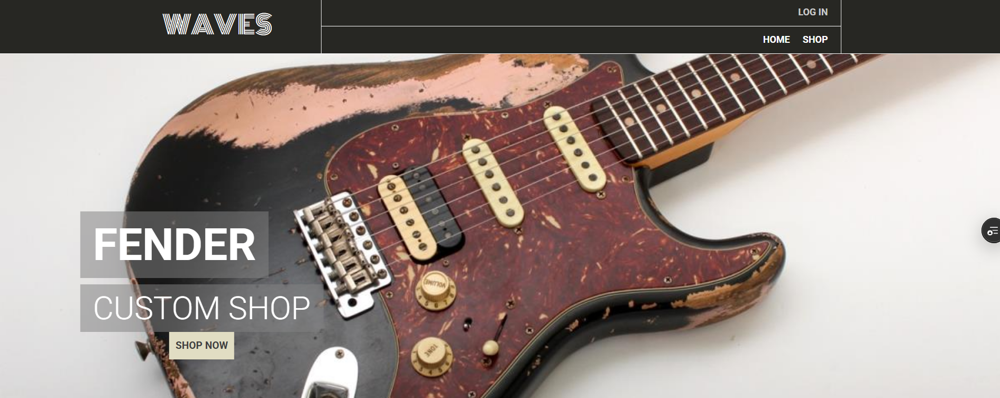
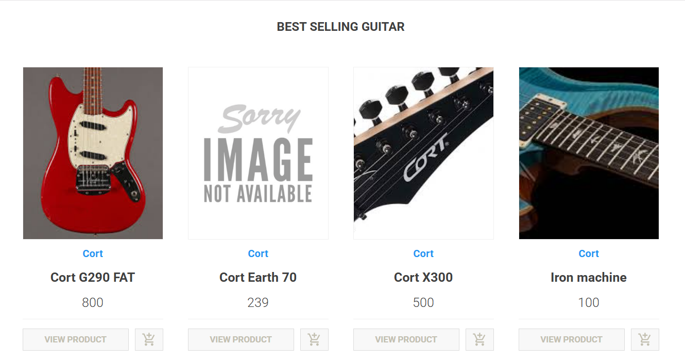
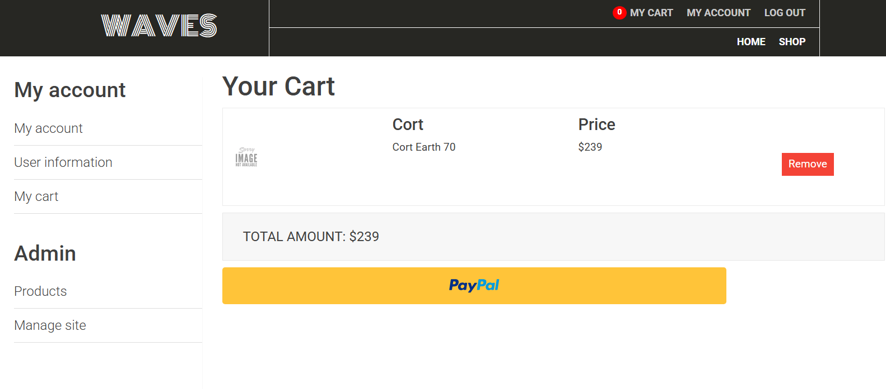
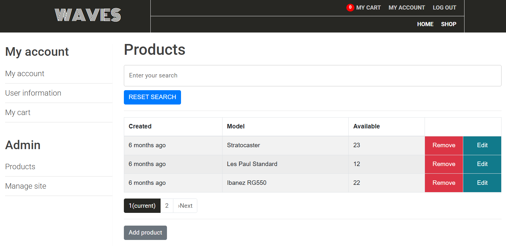

# 🎸 Waves Guitars
Waves Guitars is an online store where you can find a wide selection of guitars. 
You can browse through different categories, such as wood type, make, and brand, to find the perfect guitar for you. 
With our easy-to-use interface, you can add items to your cart and purchase them with just a few clicks.
The platform supports user registration, cart functionality, and secure checkout.

## 🔗 Live Demo

🚀 [Live Demo](https://waves-webapp-tau.vercel.app/)

---

## 🛠️ Tech Stack

**Frontend:**
- React.js
- Redux Toolkit
- Axios

**Backend:**
- Node.js
- Express.js
- MongoDB (Mongoose)
- JWT Authentication

**Other Tools:**
- Cloudinary (Image Uploads)
- Stripe (Payment Gateway)
- Bcrypt (Password Hashing)

---

## ✨ Features

### 👤 User Side
- User authentication (Login/Register)
- Browse & search for guitars
- Filter by brand, wood type, and price
- Add/remove items from cart
- Secure payment using Stripe

### 🔧 Admin Panel
- Manage guitar inventory (Add/Edit/Delete products)
- Add new brands and wood types
- View orders and user info
- Upload product images to Cloudinary

---

## 📸 Screenshots

> Add screenshots here with a markdown image tag (if available):

```md




```

---
## 📁 Project Structure

```bash
waves-guitars/
├── client/          # React frontend
│   ├── components/  # Reusable UI components
│   ├── pages/       # Page-level components (Home, Product, etc.)
│   └── redux/       # Redux slices and store configuration
├── server/          # Express backend
│   ├── models/      # Mongoose models for products, users, etc.
│   ├── routes/      # API route handlers
│   ├── middleware/  # Authentication and error handling middleware
│   └── controllers/ # Business logic and DB interactions
└── .env             # Environment variables
```
---
## 🚀 Getting Started

Follow these steps to set up and run the project locally on your machine.

---

### 📦 Prerequisites

Ensure you have the following installed:

- **Node.js** (v14 or above)
- **npm** or **yarn**
- **MongoDB** (local instance or Atlas)
- **Git**

---

### 1. Clone the Repository

```bash
git clone https://github.com/NAGHA-AKSHAYAA/Waves-Guitars.git
cd Waves-Guitars
```

### 2. Install Dependencies
# Frontend (React)
```bash
cd client
npm install
```
# Backend (Node + Express)
```bash
cd ../server
npm install
```
### 3. Configure Environment Variables
```env
MONGO_URI=your_mongodb_connection_string
JWT_SECRET=your_jwt_secret
CLOUDINARY_NAME=your_cloudinary_name
CLOUDINARY_API_KEY=your_cloudinary_api_key
CLOUDINARY_API_SECRET=your_cloudinary_api_secret
```
## ⭐️ Show Your Support

If you found this project useful or interesting, please consider giving it a ⭐️ on GitHub!


